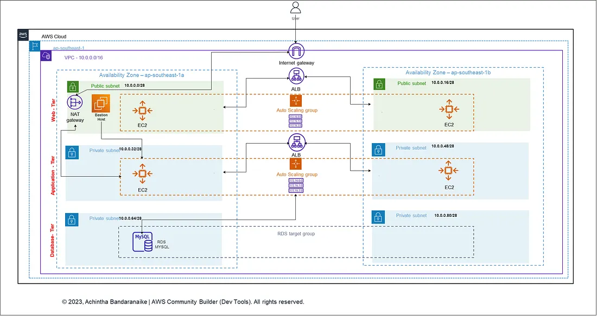

```markdown
# Highly Available Three‑Tier Architecture on AWS using Terraform

## Overview

A highly available three‑tier architecture deployed using Terraform, consisting of:

- **Web (Presentation) Tier**: EC2 Auto Scaling Group across two public subnets
- **App (Business Logic) Tier**: EC2 Auto Scaling Group across two private subnets
- **Database (Data) Tier**: RDS MySQL in private subnets
- **Network**: VPC, public/private subnets (across two AZs), Internet Gateway, NAT Gateway, routing tables
- **Bastion Host**: Secure access to private instances
- **Load Balancers**: Application Load Balancers fronting both web and app tiers

## Prerequisites

- AWS account with appropriate IAM permissions
- Terraform (v1.x) and provider plugin (AWS ~>4.x)
- AWS CLI configured (e.g. in `~/.aws/credentials`)
- An SSH key pair and familiarity with SSH/Linux
- A local editor (e.g., VS Code)

## Highly Available Three‑Tier Architecture on AWS using Terraform:


Deployment includes:

- VPC (`10.0.0.0/16`)
- **Public Subnets** (Web Tier): `10.0.0.0/28`, `10.0.0.16/28` in two AZs
- **Private App Subnets**: `10.0.0.32/28`, `10.0.0.48/28`
- **Private DB Subnets**: `10.0.0.64/28`, `10.0.0.80/28`
- Internet Gateway, NAT Gateway, Elastic IP
- Public and private route tables with appropriate associations
- Bastion host in a public subnet for secure SSH access
- Two Application Load Balancers: external for web tier, internal for app tier
- Auto Scaling Groups across AZs
- RDS MySQL instance in private DB subnet 

## Terraform Files

- `provider.tf`: AWS provider configuration and region setting
- `network_resources.tf`: VPC, subnets, IGW, NAT Gateway, route tables
- `security_groups.tf`: Define SGs for bastion, web, app, DB tiers
- `bastion.tf`: Bastion EC2 instance configuration
- `load_balancers.tf`: ALB and listener resources
- `asg_web.tf`: Web-tier launch template and ASG
- `asg_app.tf`: App-tier launch template and ASG
- `rds.tf`: RDS MySQL instance deployment
- `outputs.tf`: Terraform outputs for ALB DNS, bastion IP, RDS endpoint

(adjust module/file naming as needed)

## Usage Instructions

1. **Initialize Terraform**

   ```bash
   terraform init
````

2. **Validate & Format**

   ```bash
   terraform fmt
   terraform validate
   ```

3. **Plan**

   ```bash
   terraform plan
   ```

4. **Apply**

   ```bash
   terraform apply --auto-approve
   ```

   This will create all AWS resources.

5. **Access & Test**

   * Visit the Web ALB DNS to confirm the web tier is reachable.
   * Use the **bastion host** to SSH into app-tier instances in private subnets.
   * From app-tier EC2, connect to the MySQL database using the RDS endpoint.

6. **Teardown**

   ```bash
   terraform destroy --auto-approve
   ```

   Cleans up the deployed infrastructure.

## Security Considerations

* Bastion host located in public subnet; secure via SSH and IP restrictions.
* Security Groups tightly scoped:

  * Web SG accepts traffic from the internet (e.g. HTTP/HTTPS).
  * App SG allows traffic only from Web SG.
  * DB SG allows only MySQL access from App SG.
* Use private subnets for App and DB tiers; only necessary egress via NAT.

## High Availability Features

* **Multi-AZ deployment**: resources (subnets, ASGs, ALBs, DB instances) spread across two AZs.
* **Auto Scaling Groups** ensure redundancy for Web and App tiers.
* **RDS MySQL** deployed in private subnets (multi-AZ if configured).
* **Load Balancers** across AZs for resilience ([Medium][1], [GitHub][2], [DevOps.dev][3], [AWS in Plain English][4]).

## Customization Tips

* Adjust CIDR blocks, instance types, region (`ap‑southeast‑1` in author’s example), and scaling policies.
* Consider using two NAT gateways (one per AZ) for full HA.
* Add modules for reusability in prod environments.
* Enable enhanced monitoring, CloudWatch alarms, or backup policies for RDS.

---
